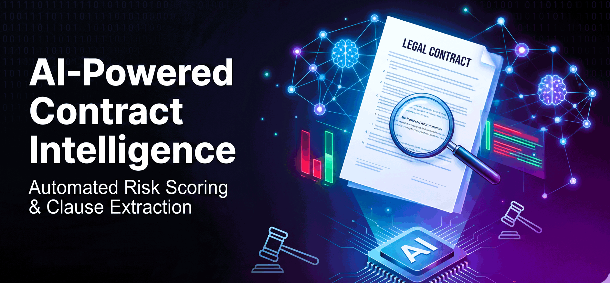
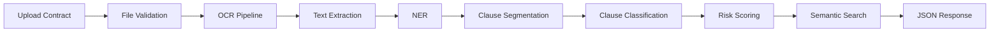
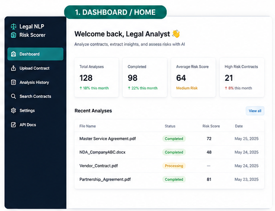
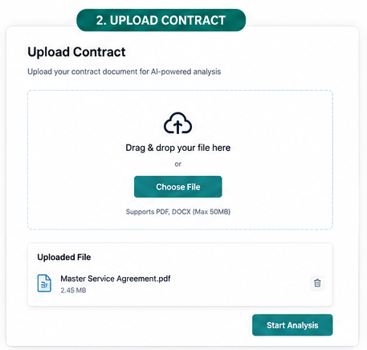
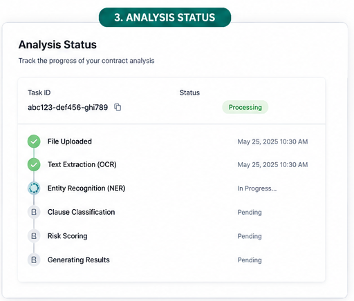
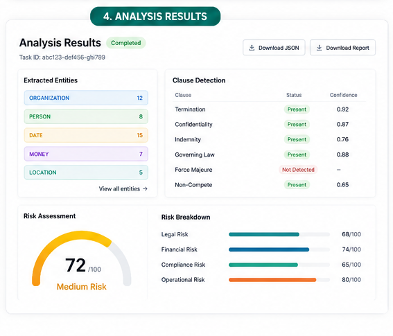
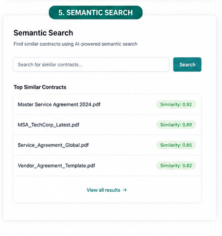
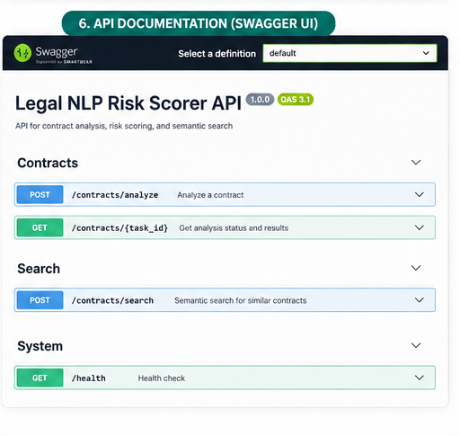

---

# AI-Powered Contract Intelligence & Risk Scoring

**One-line problem statement:** Automate the extraction of legal entities, clause classification, and risk scoring from commercial contracts to drastically reduce manual due diligence effort and mitigate compliance risks.

---

## Repository Architecture



---

## Key Features

- **Multi‑format ingestion** – supports PDF and Word documents with automatic text extraction.
- **Named Entity Recognition** – extracts parties, dates, monetary values, and jurisdictions using spaCy with custom legal patterns.
- **Clause classification** – identifies key clauses (termination, confidentiality, indemnity, etc.) via a hybrid of transformer-based fine‑tuning and rule‑based fallback.
- **Risk scoring** – assigns a risk level (Low/Medium/High) based on clause presence, mandatory clause penalties, and confidence-weighted contributions.
- **RESTful API** – FastAPI endpoints with automatic OpenAPI docs, CORS support, and health checks.
- **Asynchronous processing** – Celery + Redis for background task handling (scaffolded and ready).
- **Semantic search** – ChromaDB vector store with Sentence-Transformers embeddings for clause similarity retrieval.
- **Containerized deployment** – Docker and Docker Compose for reproducible, production-like environments.

---

## Tech Stack

| Category                  | Technologies                                                           |
| ------------------------- | ---------------------------------------------------------------------- |
| **Languages**             | Python 3.11+                                                           |
| **NLP & ML**              | Hugging Face Transformers, spaCy, PyTorch, Sentence-Transformers       |
| **OCR & PDF**             | Tesseract, EasyOCR, PaddleOCR, pdf2image, PyPDF, pdfplumber            |
| **Vector/IR**             | ChromaDB, FAISS (CPU)                                                  |
| **Backend/API**           | FastAPI, Uvicorn, Celery, Redis (broker/backend)                       |
| **Deployment**            | Docker, Docker Compose                                                 |
| **Testing & Linting**     | pytest, ruff                                                           |
| **Data Versioning**       | Git LFS (for datasets)                                                 |

---

## Current Implementation Status

| Component                                                           | Status                                                                                                                              |
| ------------------------------------------------------------------- | ----------------------------------------------------------------------------------------------------------------------------------- |
| **FastAPI contract analysis API**                                   | ✅ Implemented – `/health`, `/contracts/analyze` with CORS & lifespan startup                                                      |
| **File validation and ingestion pipeline**                          | ✅ Implemented – supports PDF, TXT, JSON; magic byte validation & schema building                                                   |
| **OCR service with multi-engine abstraction**                      | ✅ Implemented – Tesseract/EasyOCR/PaddleOCR with lazy loading & file-based caching                                                  |
| **NER extraction pipeline**                                         | ✅ Implemented – spaCy `en_core_web_sm` with fallback rules and batch processing                                                    |
| **Clause segmentation**                                             | ✅ Implemented – `O(n)` optimized heading detection (Articles, Sections, numbered clauses)                                           |
| **Clause classification framework**                                 | ✅ Implemented – Transformer scaffold + comprehensive keyword-based fallback covering 26+ clause types                              |
| **Risk scoring module**                                             | ✅ Implemented – Confidence-weighted scoring with mandatory clause penalties & actionable recommendations                           |
| **Semantic search / vector retrieval**                              | ✅ Implemented – ChromaDB + `all-MiniLM-L6-v2` embeddings with production-ready `semantic_search()` API                          |
| **Modular service‑oriented codebase**                              | ✅ Implemented – pytest (65+ tests), ruff linting, and clean dependency injection                                                    |
| **Celery asynchronous task processing**                             | ✅ Implemented – `celery_app` configured via env vars, with `process_contract_background` heavy task ready                          |
| **Dockerization**                                                   | ✅ Implemented – Multi-stage ready Dockerfile & `docker-compose.yml` with Redis, API, and Worker services                           |

---

## How to Run

### Prerequisites
- Python 3.11+
- Docker & Docker Compose (recommended for production-like demo)
- Tesseract OCR installed locally ([instructions](https://tesseract-ocr.github.io/tessdoc/Installation.html)) if running without Docker.

### Option 1: Run with Docker (Recommended)
This spins up the API, Celery Worker, and Redis in isolated containers.

```bash
# Clone the repository
git clone https://github.com/AzmatX/Legal-NLP-Risk-Scorer.git
cd Legal-NLP-Risk-Scorer

# Build and start all services
docker-compose up --build

# The API will be available at: http://localhost:8000
# Interactive Swagger docs: http://localhost:8000/docs
```

### Option 2: Run Locally (Development)

**1. Clone and Setup Virtual Environment**
```bash
git clone https://github.com/AzmatX/Legal-NLP-Risk-Scorer.git
cd Legal-NLP-Risk-Scorer
python -m venv .venv
source .venv/bin/activate      # Linux/macOS
.venv\Scripts\activate         # Windows
```

**2. Install Dependencies (including ML/Dev extras)**
```bash
pip install --upgrade pip
pip install -e .[ml,dev]
```

**3. Run the API Server**
```bash
uvicorn src.api.main:app --reload
```
The API will be available at `http://localhost:8000`. Interactive docs at `http://localhost:8000/docs`.

**4. Run Tests and Linting**
```bash
pytest -v
ruff check .
```

---

## Screenshots

### 1. Dashboard

*Overview of all analyses, recent contracts, and quick upload.*

### 2. Upload Contract

*Drag‑and‑drop or select a PDF/DOCX file for analysis.*

### 3. Analysis Status

*Real‑time progress tracking – from OCR to risk scoring.*

### 4. Analysis Results

*Detailed entities, clause classifications, and risk breakdown.*

### 5. Semantic Search

*Find similar contracts using AI‑powered vector search.*

### 6. API Documentation

*Interactive Swagger UI for programmatic access.*

---

## Example API Request / Response

**Analyze a contract:**
```http
POST /contracts/analyze
Content-Type: multipart/form-data
file: contract.pdf
```

**Response (Success):**
```json
{
  "filename": "contract.pdf",
  "entities": [
    {"text": "Acme Corp", "label": "ORG", "start": 10, "end": 18},
    {"text": "$5,000,000", "label": "MONEY", "start": 45, "end": 55}
  ],
  "clauses": [
    {"heading": "Section 1", "text": "...", "label": "governing_law", "confidence": "0.92"}
  ],
  "summary": {
    "total_clauses": 15,
    "type_counts": {"governing_law": 1, "confidentiality": 1}
  },
  "risk_factors": [...],
  "risk": {
    "risk_score": 72,
    "risk_level": "high",
    "risk_breakdown": [...],
    "missing_clauses": ["indemnification"],
    "recommendations": ["Review indemnification obligations"]
  }
}
```

---

## Dataset and Models

- **Dataset:** [CUAD (Contract Understanding Atticus Dataset)](https://www.atticusprojectai.org/cuad) – over 500 commercial contracts annotated for 41 legal categories.
- **Pre‑trained Models:** 
  - NER: spaCy `en_core_web_sm` (fallback) / `en_core_web_lg` (optional).
  - Embeddings: `sentence-transformers/all-MiniLM-L6-v2` for semantic search.
  - Clause Classification: `roberta-base` (scaffolded for fine-tuning on CUAD).
- **Future:** Fine‑tuned Legal‑BERT / RoBERTa-legal for improved clause classification and risk scoring.

---

## Roadmap (4‑Week Development Plan)

| Week | Focus |
|------|-------|
| **1** | Data parsing & baseline modeling: set up CUAD, OCR pipeline, train baseline NER. |
| **2** | Advanced NLP & fine‑tuning: fine‑tune transformer, evaluate, post‑process. |
| **3** | Vector search & API development: generate embeddings, build FastAPI, Celery integration. |
| **4** | Integration & productionization: Dockerize, load testing, documentation, final review. |

> For detailed task breakdown, see the [GitHub Issues Backlog](docs/guides/github-issues-backlog.md).

---

## Contributing

We welcome contributions! Please read our [Contributing Guidelines](CONTRIBUTING.md) and adhere to the branching strategy (`main`/`develop`/`feature/*`). All commits must be accompanied by meaningful messages and pass automated tests.

### Development Workflow
1. Fork the repository and create a feature branch from `develop`.
2. Implement your changes with tests.
3. Run `pytest` and `ruff check .` locally.
4. Open a pull request targeting `develop`.

---

## Contributors / Credits

This project is developed as part of a Production‑Level Data Science & Machine Learning initiative.  
Maintainers and contributors are listed in the [mailmap](.mailmap) and commit history.

---

## License

This project is licensed under the terms specified in the [LICENSE](LICENSE) file.
```

---