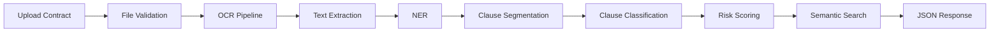

---

# AI-Powered Contract Intelligence & Risk Scoring

**One-line problem statement:** Automate the extraction of legal entities, clause classification, and risk scoring from commercial contracts to drastically reduce manual due diligence effort and mitigate compliance risks.

---

## Repository Architecture


---

## Key Features

- **Multi‑format ingestion** – supports PDF and Word documents with automatic text extraction.
- **Named Entity Recognition** – extracts parties, dates, monetary values, and jurisdictions using a spaCy baseline model.
- **Clause classification** – identifies key clauses (termination, confidentiality, indemnity, etc.) via a hybrid of transformer-based fine‑tuning and rule‑based fallback.
- **Risk scoring** – assigns a risk level to each contract based on clause presence and language anomalies.
- **RESTful API** – FastAPI endpoints for upload, analysis status, and results retrieval.
- **Asynchronous processing** – background task handling via Celery (scaffolded).
- **Semantic search** – vector embeddings for similarity retrieval across contract repositories (in progress).
- **Containerized deployment** – Docker and Docker Compose for reproducible environments.

---

## Tech Stack

| Category              | Technologies |
|-----------------------|--------------|
| **Languages**         | Python 3.11+ |
| **NLP & ML**          | Hugging Face Transformers (BERT/RoBERTa), spaCy, PyTorch |
| **OCR**               | Tesseract, pdf2image, pytesseract |
| **Information Retrieval** | Pinecone/Milvus (planned), LangChain (planned) |
| **Backend/API**       | FastAPI, Uvicorn, Celery, Redis (broker) |
| **Deployment**        | Docker, Docker Compose, AWS EC2 (target) |
| **Testing & Linting** | pytest, ruff |
| **Data Versioning**   | Git LFS (for datasets) |

---

## Current Implementation Status

| Component | Status |
|-----------|--------|
| **FastAPI contract analysis API** | ✅ Implemented – endpoints for upload, status, results |
| **File validation and ingestion pipeline** | ✅ Implemented – supports PDF, DOCX; cleaning and structuring |
| **OCR service abstraction with caching and multi-engine design** | ✅ Implemented – Tesseract backend with caching |
| **Baseline NER extraction pipeline** | ✅ Implemented – spaCy model with custom entity rules |
| **Baseline clause classification framework** | ✅ Implemented – scaffolded transformers + heuristic fallback |
| **Baseline risk scoring module** | ✅ Implemented – rule‑based scoring with configurable thresholds |
| **Modular service‑oriented codebase with test/lint setup** | ✅ Implemented – pytest and ruff configured |

| Component | Status (Partial / Baseline only) |
|-----------|----------------------------------|
| **Transformer‑based clause classification** | ⚠️ Scaffolded, but runtime relies heavily on fallback heuristics unless a fine‑tuned model is loaded. |
| **Risk scoring** | ⚠️ Currently rule‑based baseline; not yet a learned or domain‑calibrated scoring engine. |
| **Clause segmentation and clause‑wise analysis** | ⚠️ Needs strengthening – current segmentation is coarse; per‑clause context is limited. |
| **Semantic search / vector retrieval** | ⚠️ Implementation and integration need clarification; vector store service exists but not fully wired. |
| **Celery asynchronous task processing** | ⚠️ Celery app and worker are defined, but integration with API and error handling need hardening. |

> This honest assessment highlights that while the core infrastructure and baseline capabilities are solid, the system is not yet production‑ready for advanced legal NLP tasks. Further fine‑tuning and integration are required for the transformer and semantic search components.

---

## How to Run

### Prerequisites
- Python 3.10+
- Tesseract OCR installed ([instructions](https://tesseract-ocr.github.io/tessdoc/Installation.html))
- (Optional) Git LFS for dataset handling

### Clone and Setup
```bash
git clone https://github.com/AzmatX/Legal-NLP-Risk-Scorer.git
cd Legal-NLP-Risk-Scorer
```

### Create Virtual Environment
```bash
python -m venv .venv
source .venv/bin/activate      # Linux/macOS
.venv\Scripts\activate         # Windows
```

### Install Dependencies
```bash
pip install -r requirements.txt
```

### Run the API Server
```bash
uvicorn src.api.main:app --reload
```

The API will be available at `http://localhost:8000`. Interactive docs at `http://localhost:8000/docs`.

### Run Tests and Linting
```bash
pytest
ruff check .
```

---

## Screenshots

### 1. Dashboard


*Overview of all analyses, recent contracts, and quick upload.*

### 2. Upload Contract


*Drag‑and‑drop or select a PDF/DOCX file for analysis.*

### 3. Analysis Status


*Real‑time progress tracking – from OCR to risk scoring.*

### 4. Analysis Results


*Detailed entities, clause classifications, and risk breakdown.*

### 5. Semantic Search


*Find similar contracts using AI‑powered vector search.*

### 6. API Documentation (Optional)


*Interactive Swagger UI for programmatic access.*

---

## Example API Request / Response

**Upload a contract file:**
```http
POST /upload
Content-Type: multipart/form-data

file: contract.pdf
```

**Response:**
```json
{
  "task_id": "abc123",
  "status": "processing",
  "message": "File uploaded successfully. Analysis started."
}
```

**Check analysis status:**
```http
GET /status/{task_id}
```

**Response (completed):**
```json
{
  "task_id": "abc123",
  "status": "completed",
  "result": {
    "entities": [
      {"text": "Acme Corp", "label": "ORG", "start": 10, "end": 18},
      {"text": "$5,000,000", "label": "MONEY", "start": 45, "end": 55}
    ],
    "clauses": {
      "termination": {"present": true, "confidence": 0.92},
      "confidentiality": {"present": true, "confidence": 0.87}
    },
    "risk_score": 72,
    "risk_level": "medium"
  }
}
```

---

## Dataset and Models

- **Dataset:** [CUAD (Contract Understanding Atticus Dataset)](https://www.atticusprojectai.org/cuad) – over 500 commercial contracts annotated for 41 legal categories.
- **Pre‑trained Models:** 
  - NER: spaCy `en_core_web_lg` with custom extensions.
  - Clause Classification: `roberta-base` (fine‑tuned on CUAD) – currently scaffolded.
- **Future:** Fine‑tuned Legal‑BERT or RoBERTa‑legal for improved clause classification and risk scoring.

---

## Roadmap (4‑Week Development Plan)

| Week | Focus |
|------|-------|
| **1** | Data parsing & baseline modeling: set up CUAD, OCR pipeline, train baseline NER. |
| **2** | Advanced NLP & fine‑tuning: fine‑tune transformer, evaluate, post‑process. |
| **3** | Vector search & API development: generate embeddings, build FastAPI, Celery integration. |
| **4** | Integration & productionization: Dockerize, frontend/visualization, load testing, documentation. |

> For detailed task breakdown, see the [GitHub Issues Backlog](docs/guides/github-issues-backlog.md).

---

## Contributing

We welcome contributions! Please read our [Contributing Guidelines](CONTRIBUTING.md) and adhere to the branching strategy (`main`/`develop`/`feature/*`). All commits must be accompanied by meaningful messages and pass automated tests.

### Development Workflow
1. Fork the repository and create a feature branch from `develop`.
2. Implement your changes with tests.
3. Run `pytest` and `ruff check .` locally.
4. Open a pull request targeting `develop`.

---

## Contributors / Credits

This project is developed as part of a Production‑Level Data Science & Machine Learning initiative.  
Maintainers and contributors are listed in the [mailmap](.mailmap) and commit history.

---

## License

This project is licensed under the terms specified in the [LICENSE](LICENSE) file.
```
